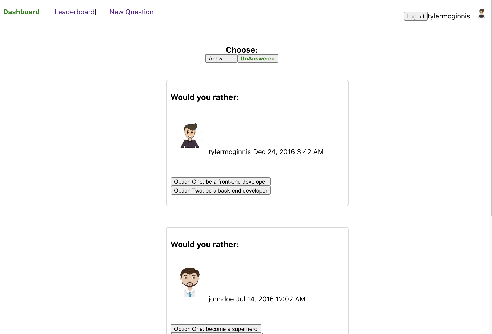
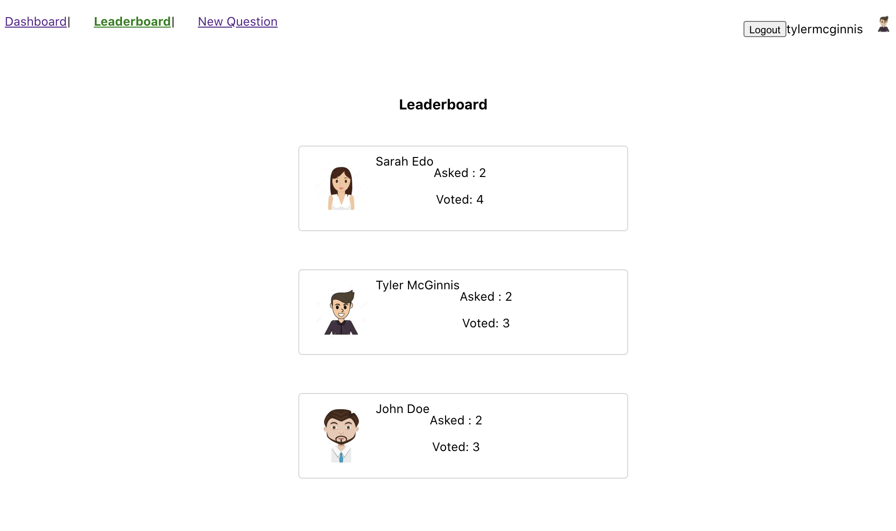
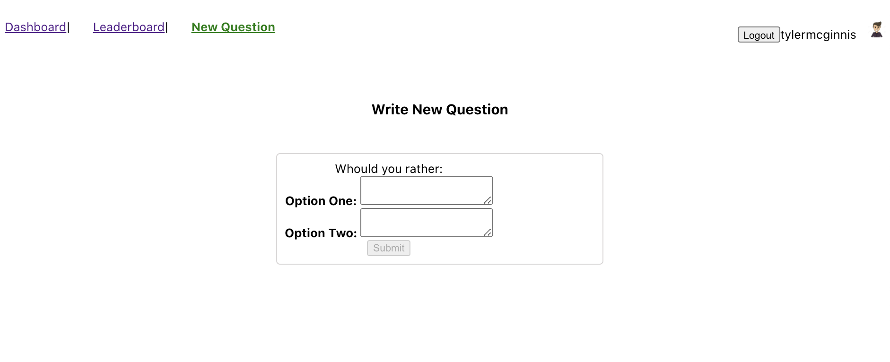
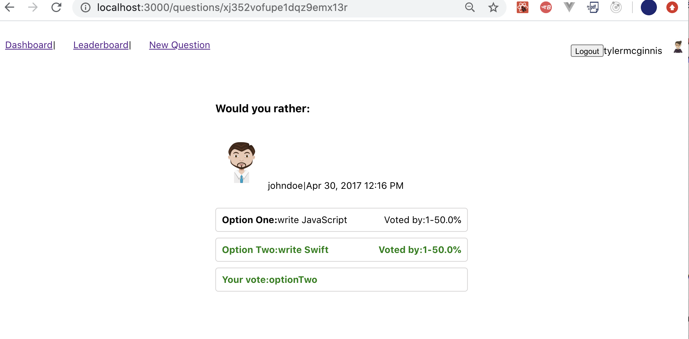

# Reactnd-project-myreads-starter
#React Project

This is a second project from a NanodegreeReact course in Udacity. 
Whould you rather  App is a sigle page app for create poll, vote and compete in leaderboard. It has a Dashboard that after logon is accessible. Questions are categorised as Answered and Unanswered. User after logon and answer questions , have access to see votes.
there is a Leaderborad page for shwoing report of user's activity.

## Used Concepts :
* Sigle page app
* How to breake UI to components, DOT
* Props
* State Management with Redux(working with reducers and actions)
* what type of information is stored in the store
* How the data in the store is modified
* Use middleware to perform asynchronous tasks 
* Use redux-thunk to make API requests in Redux 
* Concept of data immutability
* State normalization
* Functional component
* Using API to work with Json data
* Using map, filter, sort in JS
* Using objects in JS
* Using React Router
* Controlled component 


### Installing

A step by step  how to get a development env running

```
$ git clone https://github.com/larijanim/reactnd-project-myreads-starter.git
$cd reactnd-project-myreads-starter
$ npm install
$ npm start
```


## Running the tests

Not ready, I am working on that.

## components Structure

* APP.js
* Logon
* Navbar
* Dashboard
  * Question
      * QuestionDetail
        * Notfound
  * UnAnQuestion 
  * NewQuestion
  
## actions Structure
* authedUser
* questions
* users
* shared

## reducers Structure
* authedUser
* questions
* users
* index

## Screenshots of APP








## Deployment

Add additional notes about how to deploy this on a live system

## Built With

* HTML 
* CSS
* JS 
* React


## Author

  - [Maryam Larijani](https://www.linkedin.com/in/maryam-larijani-7a575082/)


